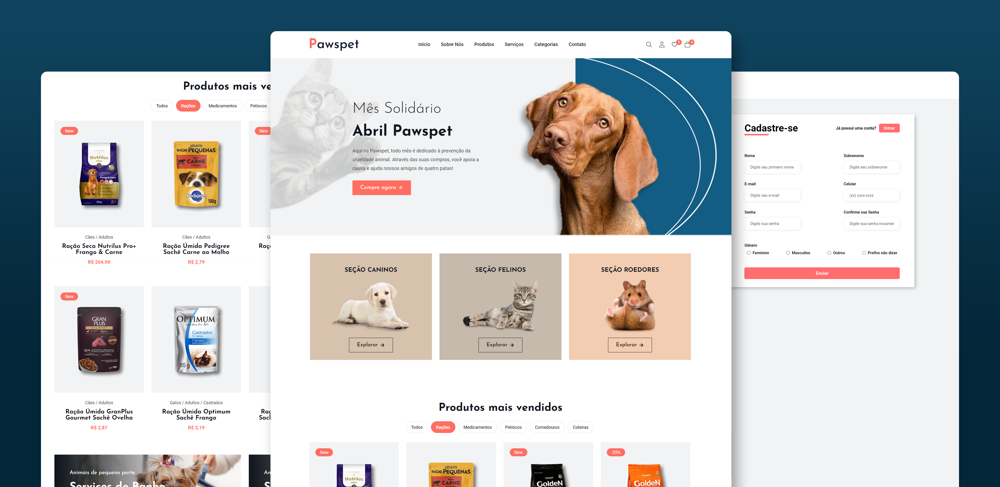

<div align="center">

  <br />

  <h1 align="center">Pawspet - PetShop Online</h1>

  Pawspet é um site de comércio eletrônico criado como parte de um projeto para uma disciplina da universidade. <br />Compatível com todos os dispositivos, construído utilizando HTML, CSS e JavaScript.

</div>

<br />

### Demo Screenshots



<br />

### Pré-requisitos

Antes de começar, certifique-se de atender aos seguintes requisitos:

* [Git](https://git-scm.com/downloads "Download Git") deve estar instalado no seu sistema operacional.

<br />

### Rodar Localmente

Para executar o **Pawspet** localmente, execute o seguinte comando no seu terminal Git Bash:

Linux e macOS:

```bash
sudo git clone https://github.com/icarodare/pawspet.git
```

Windows:

```bash
git clone https://github.com/icarodare/pawspet.git
```
<br />

### Contato

Caso queira entrar em contato comigo, faça-o através do [Email](mailto:icaro.dare@outlook.com).

<br />

### Licença

Este projeto é **gratuito para uso** e não possui nenhuma licença.
